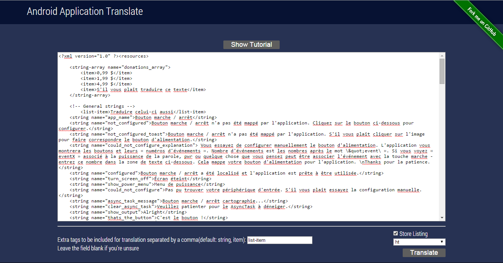
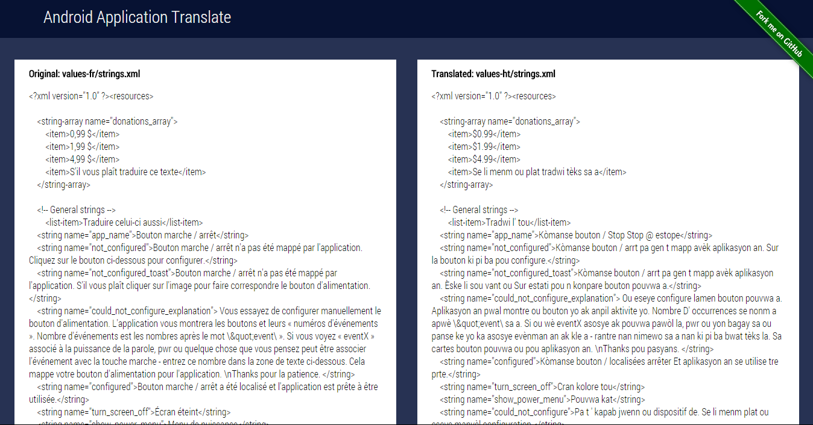

Android-Application-Translation
===============================

#####Project Synopsis 

This is a rudimentary Google App Engine python application to translate the contents of `strings.xml`

You can use the application here - [android-app-translation](http://android-app-translation.appspot.com)

#####Example

1. General translation

        From: English
        <strings name="monday">Monday</string>
        To: German
        <strings name="monday">Montag</string>
        
2. Exclude certain strings
        From: English
        <string name="monday"><!--exclude-->Monday</string>
        To: German
        <string name="monday"><!--exclude-->Monday</string>

#####Things that need to be fixed/built
1. A more fluid, sleek UI
2. Simultaneous translations of multiple languages
3. Direct downloads for the new strings.xml files

#####Contributions

If you'd like to contribute to the project, feel free to fork the project make your changes and commit it to a separate branch and then perform a pull request.

#####Licensing
The project is licensed under the MIT License.

#####Screenshots

